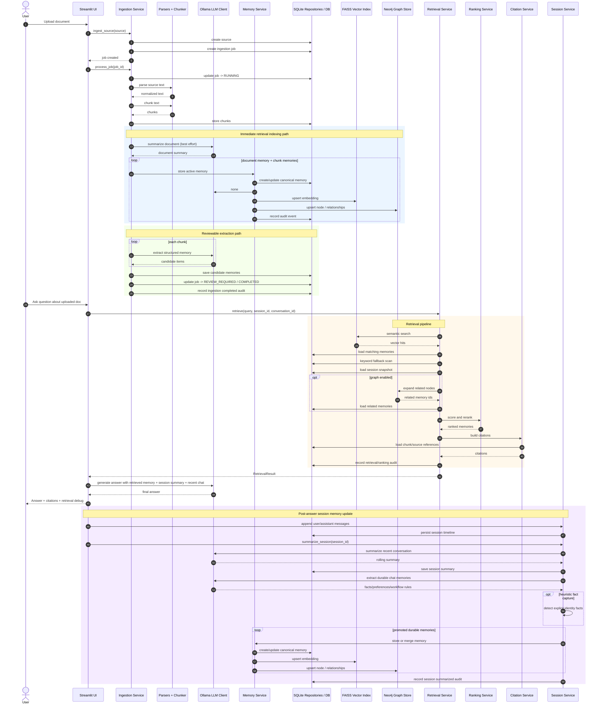

# Personal Context MCP Memory System

Offline, local-first document memory system built around:

- Python 3.14
- Ollama for generation and extraction
- sentence-transformers for local embeddings
- FAISS for vector retrieval
- Neo4j for graph relationships
- SQLite for canonical metadata, jobs, sessions, and audit history
- Streamlit for the user interface
- MCP for tool-style access

## Status

The core architecture is implemented:

- domain models and contracts
- SQLite repositories
- FAISS vector adapter
- Neo4j graph adapter
- ingestion pipeline
- retrieval, ranking, and citations
- Ollama client
- review and lifecycle services
- MCP server
- Streamlit UI

## Python Version

As of April 25, 2026, the latest stable Python release is `3.14.4`, released on April 7, 2026:

- [Python.org latest release page](https://www.python.org/downloads/latest/)
- [Python source releases](https://test.python.org/downloads/source/)

This project targets the Python `3.14` series.

## Project Layout

```text
memory_core/
  domain/        Core models and enums
  interfaces/    Contracts for services and adapters
  storage/       SQLite, FAISS, and Neo4j adapters
  embeddings/    Local embedding providers
  llm/           Ollama client
  ingestion/     Parsing, chunking, extraction flow
  ranking/       Fixed hybrid scoring
  retrieval/     Vector shortlist + graph expansion + reranking
  citations/     Citation assembly
  services/      Lifecycle and review orchestration
adapters/
  mcp/           FastMCP server wiring
  streamlit_ui/  Streamlit app
tests/
  unit/          Fast unit tests
```

## Setup

1. Install Python `3.14.x`.
2. Create and activate a virtual environment.
3. Install dependencies:

```powershell
python -m pip install -e .[dev]
```

4. Copy the env template if needed:

```powershell
Copy-Item .env.example .env
```

5. Start Ollama and make sure the model is available:

```powershell
ollama pull llama3.1
```

6. If using Neo4j, start it locally and update the credentials in `.env`.

## Run The Streamlit UI

```powershell
streamlit run app.py
```

## Run The MCP Server

```powershell
python mcp_server.py
```

Or after editable install:

```powershell
personal-context-mcp-server
```

## Run Tests

```powershell
pytest
```

## Notes

- The system is fully local-first by design, but you may use online LLMs hosted by OpenAI or OpenRouter or any other platform by modifying the .env file, as long as the LLM conforms to OpenAI API.
- FAISS is currently kept as the vector backend because `faiss-cpu` publishes Windows wheels for CPython 3.14.
- The Streamlit chat uses retrieval-grounded local generation through Ollama.
- Candidate memories remain reviewable before becoming canonical active memory.


## Technical Architecture

**How It Works**

* `Streamlit UI` is the human-facing app for chat, upload, review, browsing, and audit.
* `MCP Server` exposes the same core capabilities as tool-style operations for external agents/clients.
* `Ingestion Service` parses uploaded content, chunks it, auto-indexes document and chunk memories, and creates reviewable extracted candidates.
* `Memory Service` is the canonical lifecycle layer. It writes memory to SQLite, syncs FAISS embeddings, syncs Neo4j graph nodes/links, and handles merge/delete/versioning.
* `Retrieval Service` is the main answer-context builder. It combines vector search, keyword fallback, profile-memory inclusion, optional graph expansion, reranking, and citations.
* `Session Service` keeps recent conversation state and promotes durable facts/preferences/workflow rules into persistent memory across sessions.
* `Review Service` lets extracted candidates become active memory only after accept/merge decisions.
* `Ollama` handles generation, summarization, and memory extraction.
* `Sentence-Transformers` handles local embeddings for both indexed memory and live queries.
* `SQLite` is the source of truth; `FAISS` is the semantic retrieval index; `Neo4j` adds relationship/provenance context.

**Key Data Flows**

1. **Document Ingestion**
* User uploads file in Streamlit
* `Ingestion Service` parses and chunks it
* `Memory Service` stores active document/chunk memories
* embeddings are generated and written to `FAISS`
* graph nodes/relationships are written to `Neo4j`
extracted higher-level candidates go to review storage

2. **Chat / Answer Generation**
* User asks question in Streamlit
* `Retrieval Service` searches `FAISS`, applies keyword fallback, optionally expands via `Neo4j`, reranks, and attaches citations
* recent session context and durable chat memories are included
* `Ollama` generates the final answer from retrieved context

3. **Cross-Session Memory**
* chat messages are stored in SQLite session tables
* `Session Service` summarizes recent conversation and promotes durable facts/preferences/workflow rules into persistent memory
* those promoted memories become searchable in future sessions

4. Audit / Admin
* ingestion, retrieval, review, and memory lifecycle actions are logged in SQLite audit tables
* Streamlit admin views expose candidate review and audit inspection

